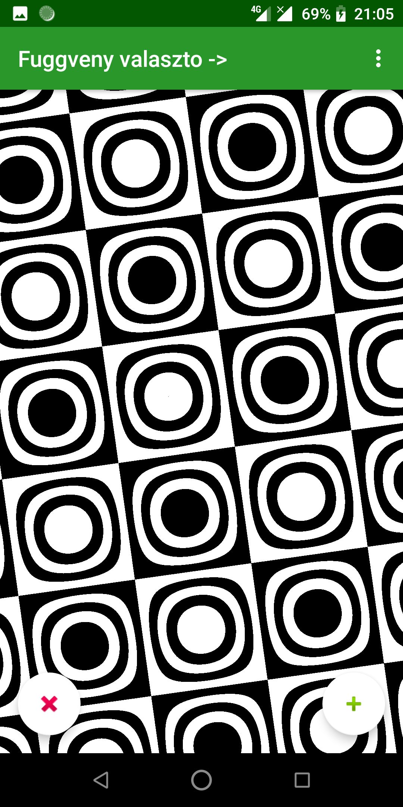

# Tantárgyi Alkalmazások 3 Beadandó

## 6. Feladat

Készíts 2-változós függvényrajzoló programot színárnyalatos módszerrel, amelyben csak
két színt használhatsz és egyenlő fényességintervallumok tartoznak az egyes színekhez!
Beadandó: a feladatot megoldó program tetszőleges programozási nyelven. Felhasználói
dokumentáció szövegszerkesztővel, függvény képekkel.

## Alap funkcionalitás

### Zoom

A szokásos kétújjas telefonos zoom implementálva lett, de a függvények szimetriája, és az ábrzolás módja miatt nem minden függvényen látható.

|elötte|utána|
|-|-|
|  | |

### Forgatás

Továbbá a függvények eggy újjal forgathatóak a középpont körül.

|elötte|utána|
|-|-|
|  | |

### Függvény választó

A menüsorból lehet a beépített függvények közül választani

|elötte|utána|
|-|-|
|  | |

### A K paraméter növelése csökkentése

A képernyő alján lévő két gombbal növelhető csökkenthető a K.

|k 10|k 11|k 12|k 13|
|-|-|-|-|
|  | |||


# Technikai részletek

A program kotlin nyelven íródott androidra

## A feladatot megoldó fügvényt ábrázoló függvények
```kotlin
    fun drawFunction(f: (Double, Double) -> Double, minX: Double, maxX: Double, minY: Double, maxY: Double) {
        if (minX >= maxX || minY >= maxY) return
        val fValues = calcFValues(f, minX, maxX, minY, maxY)
        val pixels = if(mode==0) pixelsFromFValues(fValues)
            else myPixelsFromFValues(fValues)
        val bm2 = Bitmap.createBitmap(pixels, iv.width, iv.height, Bitmap.Config.ARGB_8888)
        iv.setImageBitmap(bm2)
    }

    private fun calcFValues(f: (Double, Double) -> Double, minX: Double, maxX: Double, minY: Double, maxY: Double): DoubleArray {
        val height = iv.height
        val width = iv.width

        var minVal = f(minX, minY)
        var maxVal = f(minX, minY)
        val stepX = (maxX - minX) / width
        val stepY = (maxY - minY) / height
        val fValues = DoubleArray(width * height)

        val rotc = Math.cos(rotation.toDouble()/360*2*Math.PI)
        val rots = Math.sin(rotation.toDouble()/360*2*Math.PI)
        var y = minY
        for (i in 0 until height) {
            var x = minX
            for (j in 0 until width) {
                var akt:Double
                try {
                    akt = f( x*rotc-y*rots, x*rots+y*rotc )
                } catch (exception: Exception) {
                    akt = 0.0
                    Log.println(Log.ERROR, "function error", "${exception.message}")
                }
                fValues[i * width + j] = akt
                if (akt < minVal) minVal = akt
                if (akt > maxVal) maxVal = akt
                x += stepX
            }
            y += stepY
        }

        val maxDifference = maxVal - minVal

        for (i in 0 until height) {
            for (j in 0 until width) {
                fValues[i * width + j] = (fValues[i * width + j] - minVal) / maxDifference
            }
        }
        return fValues
    }

    private fun pixelsFromFValues(fValues: DoubleArray): IntArray {
        val height = iv.height
        val width = iv.width
        val pixels = IntArray(width * height)
        for (i in 0 until height) {
            for (j in 0 until width) {
                val isBlack = ((fValues[i * width + j] * K).toInt()) % 2 == 0
                pixels[i * width + j] = if(isBlack)Color.BLACK else Color.WHITE
            }
        }
        return pixels
    }
}
```

